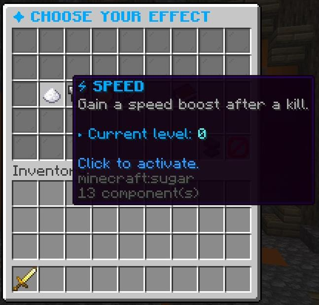
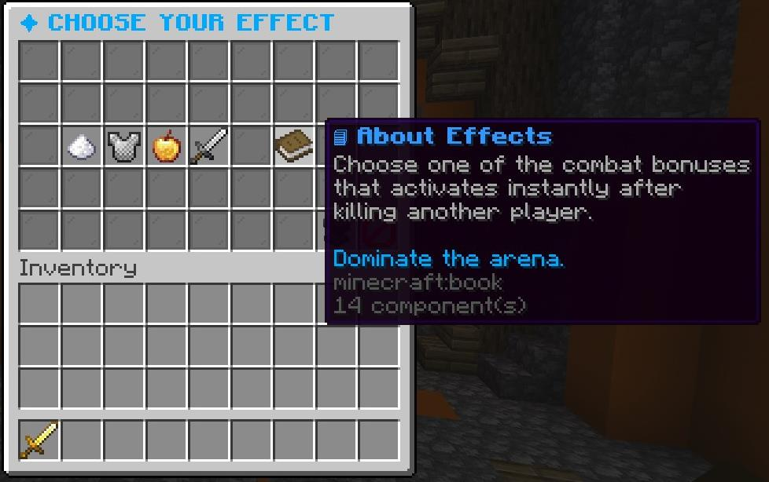
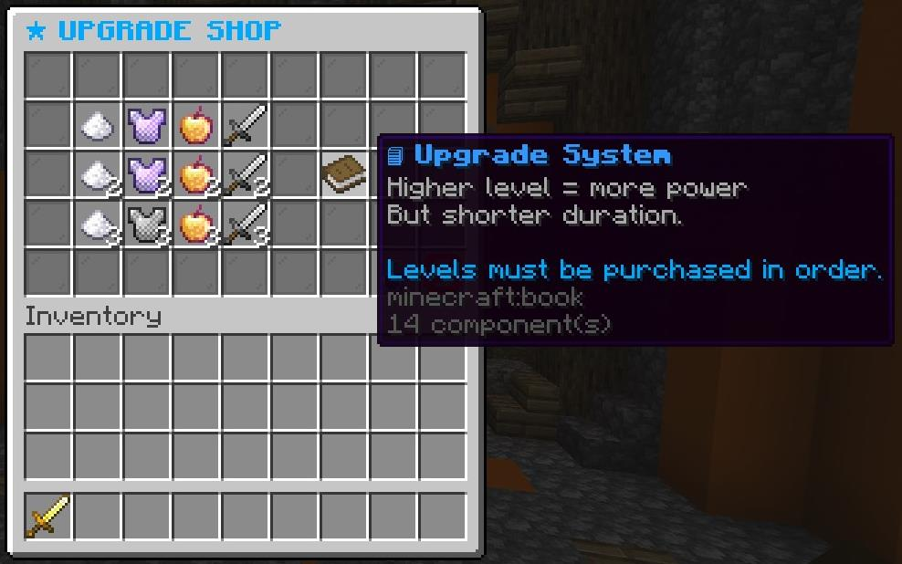
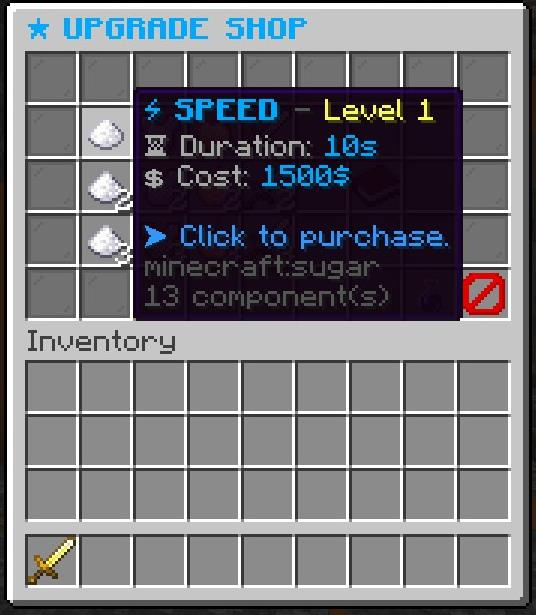
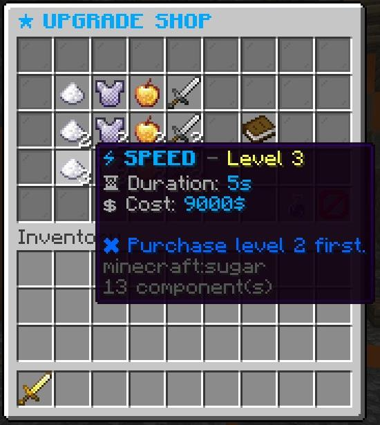
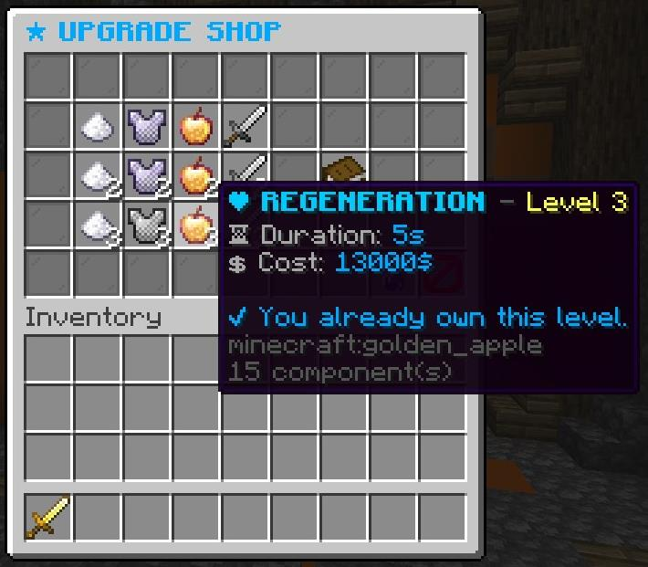
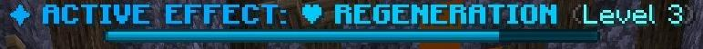

<h1 align="center">⚔ f0Effect</h1>

  Advanced Kill Effect System for Competitive Minecraft PvP Servers

  
  
  
  
  

---

## ✨ Overview

**f0Effect** is a competitive PvP plugin that grants temporary combat effects after killing another player.

Each effect can be upgraded:

- Higher level → stronger amplifier  
- Higher level → shorter duration  
- Higher level → significantly higher cost  

The system is built for fast arena gameplay and clean visual feedback.

---

# 🎮 Effect Selection GUI

  

### Clean and Minimal Layout

Players can:

- Select one active effect
- See current upgrade level
- Instantly activate it
- Navigate to upgrade shop

Simple layout. No clutter. Immediate feedback.

---

# 📘 About Effects Panel

  

Short explanation directly inside GUI.

Clear information:
- Effects activate after killing a player
- Designed for arena PvP
- Fast-paced combat boost system

---

# ⬆ Upgrade Shop

  

### Upgrade Philosophy

Higher level means:

- More power  
- Shorter duration  
- Higher investment  

Levels must be purchased in order.

---

## 💰 Purchasing Example

  

- Duration displayed clearly
- Cost shown directly
- One-click purchase

---

## 🔒 Locked Level Example

  

If a previous level is missing, purchase is blocked automatically.

Prevents skipping progression.

---

## ✅ Already Owned Level

  

Clear feedback when player already owns the upgrade.

---

# 📊 BossBar Display

  

When effect activates:

- Blue BossBar appears
- Displays effect name
- Displays current level
- Automatically disappears after duration

Fully configurable in `config.yml`.

---

# 🔥 Default Effects

| Effect       | Description |
|-------------|------------|
| ⚡ SPEED        | Movement boost after kill |
| 🛡 RESISTANCE   | Damage reduction |
| ❤ REGENERATION | Health recovery |
| ⚔ STRENGTH     | Increased attack damage |

### Default Duration Scaling

| Level | Duration |
|--------|----------|
| I      | 10 seconds |
| II     | 7 seconds |
| III    | 5 seconds |

20 ticks = 1 second.

---

# ⚙ Configuration

Fully customizable:

- Messages (HEX color support)
- GUI layout
- Sounds
- MySQL database
- BossBar style
- Effect cost and amplifier scaling

Official references:

Materials:  
https://hub.spigotmc.org/javadocs/spigot/org/bukkit/Material.html  

Sounds:  
https://hub.spigotmc.org/javadocs/spigot/org/bukkit/Sound.html  

---

# 🛠 Installation

1. Place plugin into `/plugins`
2. Restart server
3. Configure `config.yml`
4. Done

Supports modern Spigot and Paper versions.

---

# 🚀 Roadmap

### Planned Features

- [ ] PlaceholderAPI support  
- [ ] Per-arena configuration  
- [ ] Effect cooldown system  
- [ ] Player statistics tracking  
- [ ] Particle customization  
- [ ] Transferring the remaining messages to the config 

---

# 📈 Why f0Effect?

- Competitive balance focused
- Short but impactful mechanics
- Clean modern GUI
- Clear feedback system
- Lightweight and scalable

Built for serious PvP servers.

---

# 📜 License

MIT License

---

  Designed for competitive Minecraft environments.

